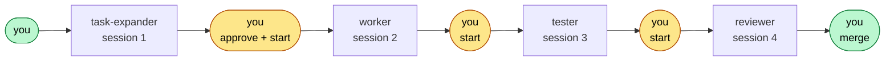
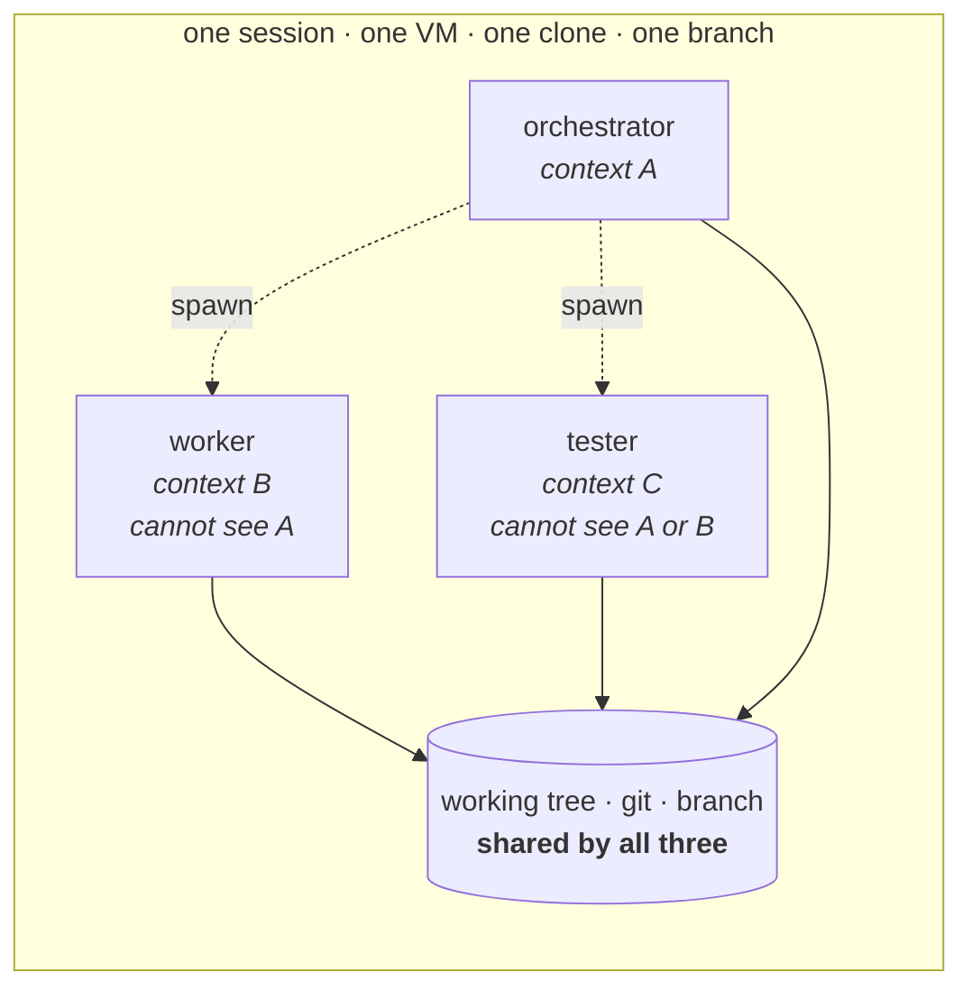
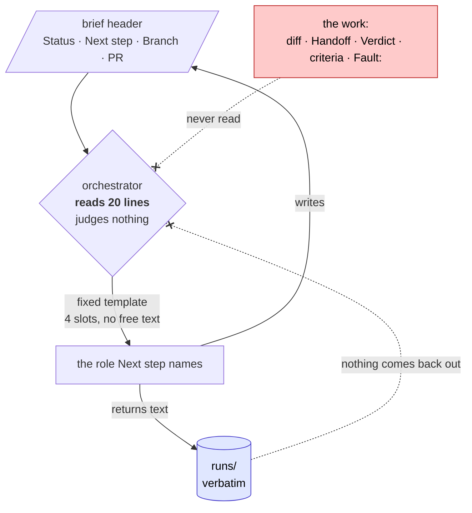
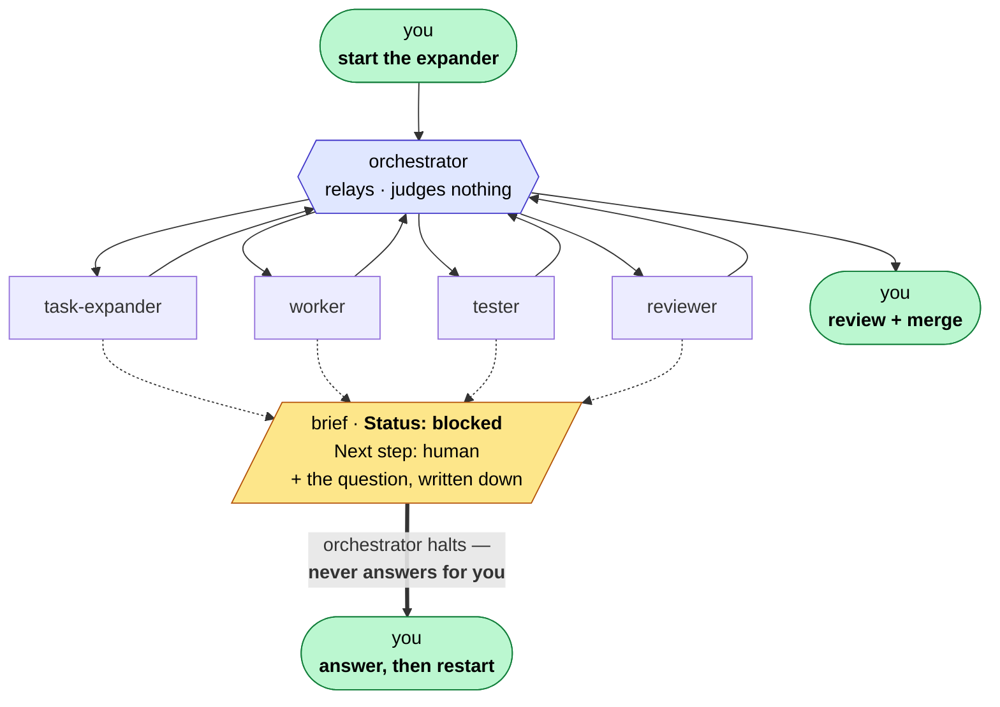

# `.claude/agents/` — the five roles, and how they are isolated

Five agent definitions. Four do the work of a task; the fifth moves the task
between them. This file is about **how they are kept apart**, which is the whole
design — [`process.md`](../../process.md) is about what each one does.

The short version: the loop's only real check is a tester that knows nothing
except the brief. Everything here exists to keep it that way while removing the
person who used to sit between the steps.

| Role | Step | Writes | Never sees |
|---|---|---|---|
| `task-expander` | 2 | the brief, the branch, the draft PR | whether the current code passes |
| `worker` | 3 | source, data, docs | the verification tests |
| `tester` | 4 | tests, the Verdict | — (starts cold, by design) |
| `reviewer` | 6 | review, sweep, marks PR ready | — (never reviews its own work) |
| `orchestrator` | — | `runs/`, the `Approved:` line | **all of the above's work** |

## Where the human used to stand

Four sessions, and **you** between every pair. Two of those stops are real
judgement — starting the task, and merging it. **The three amber ones are not.**
They are a person waiting to type the next command, having read one line of a file
to decide which command it is.

That is the gap. It is not a thinking gap; it is a latency gap.

## What a subagent actually is

Not a new machine. Not a new checkout. **A new context window on the same
everything else.**

| | Shared with the parent | Isolated |
|---|---|---|
| Conversation / transcript | ✗ | **✓ — this is the isolation** |
| The prompt it receives | ✓ (parent writes it) | ✗ |
| Working tree, branch, git | ✓ | ✗ |
| Session id | ✓ | ✗ |
| Tool grants | per its own frontmatter | — |

**Two consequences fall straight out of that table, and they pull opposite ways.**

*Good:* a spawned tester inherits **exactly and only the text of its prompt**. It
cannot read the worker's reasoning because it was never in the room. The isolation
that used to require four separate sessions is free.

*Bad:* the session id is shared, so the tester finds its own id in the brief's
Sessions table under `worker`. The check that made independence *auditable*
stops working, and the tester is told to say so in its Verdict rather than claim
it passed. **Real independence, weaker evidence.**

## What the orchestrator is, and what it refuses to be

Three mechanisms, and none of them is restraint:

- **It reads the brief's header and nothing else.** It cannot leak an opinion
  about the implementation because it never forms one.
- **The spawn prompt is a template** — role, task id, brief path, branch. No
  free-text field, so there is nowhere for a helpful sentence to go.
- **`runs/` is a one-way valve.** Results go in; nothing comes back out into a
  prompt.

A judging orchestrator was written first and scrapped before it ran. One helpful
sentence to the tester — *"the lockfile was hand-edited, check criterion 9"* —
aims the only independent check in the loop at what was built instead of what was
asked for. It returns `pass`, nobody lied, and the check is now a guided one.
**You cannot leak what you never read.**

## The gap it closes, and the three it does not

**Every role has that dotted escape, and it is the only one it has.** A spawned
role cannot reach a person — it can only return text — so "ask a question" is
implemented as *write it into the brief and stop*. The orchestrator then reads
`Status: blocked` in the header and halts without reading the question, because
answering it is not its call: `CLAUDE.md` reserves dependencies, product
decisions and anything a child will read for a person, and that outranks the
orchestrator.

**Halting is a normal outcome, not a failure.** It costs a restart. Guessing
costs a task built on a wrong assumption that nobody looked at.

| | Before | After |
|---|---|---|
| **Three waits to type a command** | you, three times | **closed** — the orchestrator relays |
| Starting the task | you | **you** — by design, D-1 |
| Merging | you | **you** — by design, D-4 |
| A role hits something only you can decide | you, in ten seconds, mid-session | **you** — but the run halts and restarts |
| Approving the criteria | you, at step 2 | **nobody**, and the brief says so |

**Only one row actually changed hands, and it is the one that was never
judgement.** The three green stops in the diagram are deliberate and stay — start,
decide, merge. What an unattended run costs is the last two rows:

**Nobody reads the criteria before the work is built.** The orchestrator writes
`Approved: orchestrator — <date>, unattended run` *without having read them* —
reading them is exactly what D-3 forbids. That line is a record that nobody
checked, not a certification. It is the whole price of the role.

**A spawned role cannot ask a question.** It can only return text, so it writes
the question into the brief, sets `Status: blocked`, and stops. The behaviour
survives; the latency does not — which creates real pressure on a role to guess
instead of asking. Watch for a Handoff that resolves an ambiguity confidently and
does not say who decided.

## How it must be launched — verified, not assumed

Nesting is **one level deep** in this harness, which decides the whole question:

| The orchestrator is… | Spawn tool it gets | Works? |
|---|---|---|
| spawned as a subagent by another session | **none — stripped** | **no** |
| the top-level session (`claude -p --agent orchestrator`) | `Agent` | **yes** — a real spawn returned |

**So the orchestrator has to *be* the session, not something a session spawns.**
The same limit is what stops a worker calling a tester — it arrives from the
harness rather than from our rules, which is convenient and not ours to rely on.

Untested: whether a Claude Code **web** session can be started as the orchestrator
at all. If it cannot, the agent is unusable in the environment it was written for
and [`run-loop.sh`](../loop/run-loop.sh) is the only unattended path, not merely
the preferred one.

## Three ways to run the same loop

| | Manual | **Driven** — [`run-loop.sh`](../loop/) | Relayed — `orchestrator` |
|---|---|---|---|
| Who advances a step | you | `bash` | the agent |
| Isolation between roles | separate sessions | separate **processes** | separate contexts |
| Session id per role | distinct | **distinct** | one, shared |
| Tester's independence | evidence | **evidence** | attestation |
| Spend cap per step | — | **CLI-enforced** | none |
| Gates | you, reading | `case` statements | instructions it applies to itself |
| Runs on | anywhere | a local shell | anywhere a session runs |

**Prefer the driver wherever a shell can run.** It is the same six gates, but
enforced by something that cannot be reasoned out of one — and it restores the
independence check to evidence. The agent exists for the environment with no
shell to leave running.

Neither has yet driven a task end to end.
